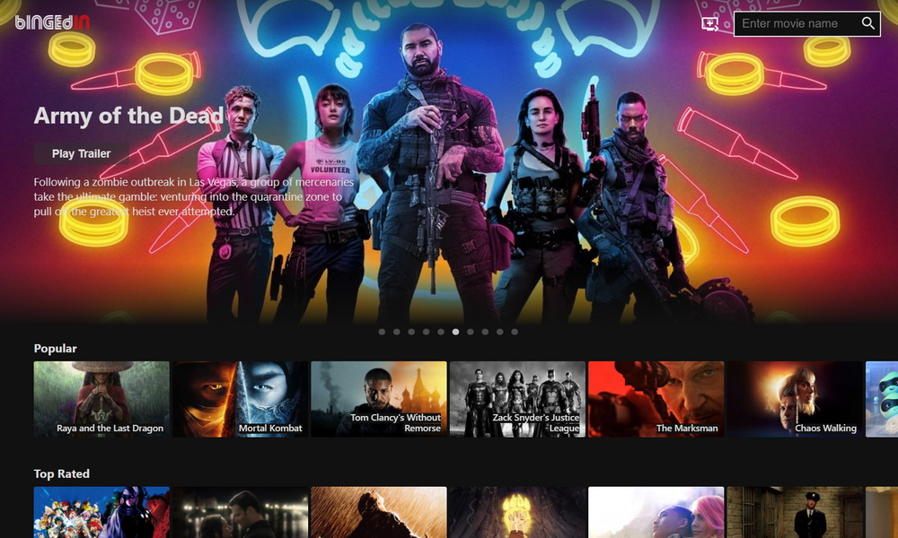

# bINGEdIN

bINGEdIN is a movie app where users can view infos and watch trailers of movies over a variety of genres. It features a search functionality, and a watch list that stores the user's added movies in local storage. The app was built with React.js with styled components, utilising TMDB's APIs for movie data and YouTube for trailers.

Live site: [https://bingedin.netlify.app](https://bingedin.netlify.app)

## Stack

## Key Features

- Browse new movies and movies by genres
- Watch trailers of all movies
- Search movies and add to watch list
